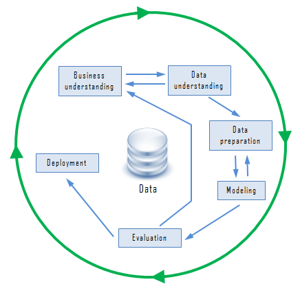

# Introduction to Data Mining

## Data Problems

 * Huge amount of data is generated and stored daily - Big Data
   * Business, economics, science, medicine, ...
 * Gap between data generation and data understanding
   * Raw data isn't useful
   * The patterns underlying the data is useful

## Finding Information in Data

#### Example 1: *in vitro fertilization*
 ```
  Given:    embryos described by 60 features
  Problem:  selection of embryos that will survive
  Data:     historical records of embryos and outcome
 ```

 #### Example 2: *cow culling*
 ```
  Given:    cows described by 700 features
  Problem:  selection of cows that should be culled
  Data:     historical records and farmers' decisions
 ```

__Definition:__ *Data Mining is the extraction of meaningful patterns and information from data in large amounts (semi)automatically*
 - Good patterns can help make good predictions on new data
   - Can be in a black box
   - In transparent box -> Structural patterns
     - If-then rules, decision trees, ...

## Data Mining Tasks

 - Major data mining tasks include:
   - Classification: single or multiple classes
   - Regression
   - Association rules
   - Cluster analysis
   - Others
     - Sequential rules, time series, spatial data mining, ...
     - Text mining, web page mining, link/graph mining, ...
     - ...

## Applications of Data Mining

*Results of learning, or the learning method are deployed in practical applications*
   - Automatic selection of TV programs
   - Screening images for oil slicks
   - Marketing and sales
   - ...

## Data Mining Process



## Data Mining Ethics

 - Ethical issues arise in practical applications
   - Often used to discriminate
     - e.g. loan applications: using some information is unethical (sex, religion, race)
   - Ethical situation depends on application
     - e.g. some information is okay for medical applications
   - Attributes may contain problematic information
     - e.g. area code correlating to race ????
   - Re-identification: anonymizing information is difficult
     - 85% of Americans can be identified by just zip code, birth date, and sex
   - Using personal information
     - When information is collected, they should know through plain language and not sketchy small print
     - Important questions when collecting data:
       - Who is permitted access to the data?
       - What is the purpose for collecting the data?
       - What legitimate conclusions can be drawn from this data?
